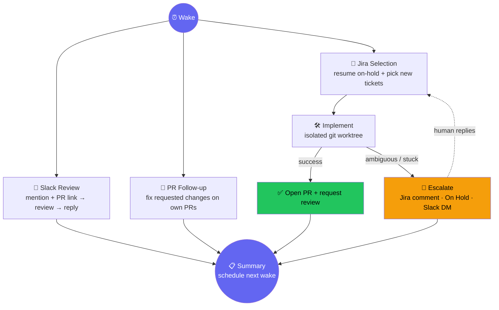

# ultracode-live-engineer

An unattended Claude Code loop that reviews PRs you're @-mentioned on in Slack and works your Jira backlog — self-paced, forever, until you stop it.

No human input required mid-pass — anything ambiguous parks itself on hold and picks back up automatically once a person replies.

## What it does

|                        |                                                                                                           |
| ---------------------- | --------------------------------------------------------------------------------------------------------- |
| 👀 **Slack Review**    | Scans a channel for `@you` + a PR link, runs a full review, approves outright if only nits survive        |
| 🎫 **Jira Backlog**    | Root-causes, implements, tests, and PRs tickets in a "ready" status — in an isolated worktree             |
| 🔁 **PR Follow-up**    | Fixes review feedback / failing checks on its own open PRs                                                |
| 🚧 **HITL Escalation** | Can't reproduce, needs a judgment call, not converging → Jira comment + On Hold + Slack DM, never guesses |

Fully config-driven — repo, Slack channel, Jira project, everything lives in a per-project `config.json`, never in the plugin.

## Layout

| Path                                     | Purpose                                                                                  |
| ---------------------------------------- | ---------------------------------------------------------------------------------------- |
| `skills/ultracode-live-engineer/`        | Thin driver — reads config, runs the workflow, schedules the next wake via `/loop`       |
| `workflows/ultracode-live-engineer.js`   | The multi-agent Workflow — all domain logic                                              |
| `workflows/ultracode-live-engineer/lib/` | Deterministic rules (open PR? exact mention? stale branch?) — not left to model judgment |
| `skills/ticket-to-pr/`                   | Generic starter skill for ticket implementation — `TODO(project)` markers to fill in     |
| `skills/review-pr-strict/`               | Adversarial multi-agent PR review, tuned for no-human-in-the-loop use                    |
| `skills/ask-team-to-review/`             | Posts a review request to Slack — reviewer tagging fully config-driven, no baked roster  |

## Prerequisites

- [ ] Claude Code with `/loop` available
- [ ] Connected Atlassian MCP (Jira) + Slack MCP servers
- [ ] `gh` CLI authenticated as the acting GitHub account
- [ ] Your own `ticket_to_pr` skill, customized from the shipped starter

## Install

1. Install the plugin — `${CLAUDE_PLUGIN_ROOT}` then resolves to it.
2. In the **target repo**, copy `workflows/ultracode-live-engineer/config.example.json` → `.claude/ultracode-live-engineer/config.json` and fill it in (see `CONFIG.md`). One config per repo — point the loop at as many as you like.
3. Fill in the `TODO(project)` markers in `skills/ticket-to-pr/`.
4. Kick off with `/loop` → `Skill("ultracode-live-engineer")`. It paces its own wake-ups from there.

## Safety model

Every dispatched prompt carries hard guardrails: never merge, never force-push, never push to the default branch, never skip hooks/tests, always an isolated worktree, a configurable cap on tickets in flight. Anything mechanically decidable (PR open? exact mention token? branch abandoned?) is deterministic code, not model judgment — see `lib/slack_scan.py` / `lib/github.py`.

## License

MIT — see `LICENSE`.
