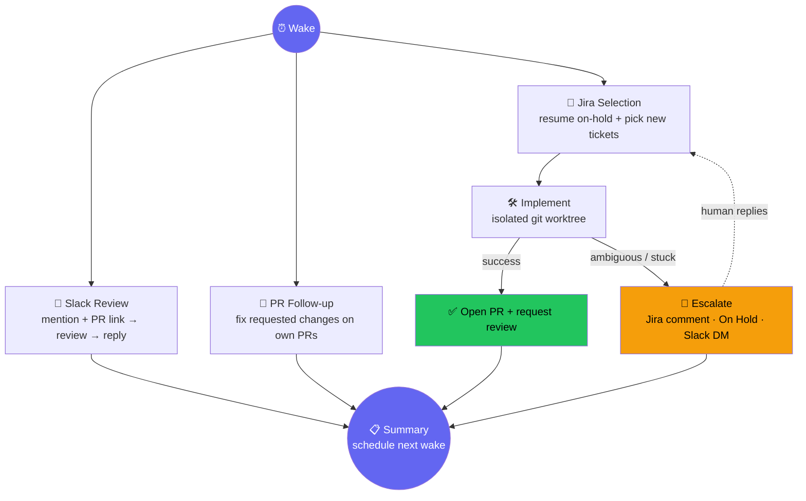

# ultracode-live-engineer

An unattended Claude Code loop that reviews PRs you're @-mentioned on in Slack and works your Jira backlog - self-paced, forever, until you stop it.



No human input required mid-pass. Anything ambiguous parks itself on hold and picks back up automatically once a person replies.

## What it does

|                        |                                                                                                           |
| ---------------------- | --------------------------------------------------------------------------------------------------------- |
| 👀 **Slack Review**    | Scans a channel for `@you` + a PR link, runs a full review, approves outright if only nits survive        |
| 🎫 **Jira Backlog**    | Root-causes, implements, tests, and PRs tickets in a "ready" status - in an isolated worktree             |
| 🔁 **PR Follow-up**    | Fixes review feedback or failing checks on its own open PRs                                               |
| 🚧 **HITL Escalation** | Can't reproduce, needs a judgment call, not converging → Jira comment + On Hold + Slack DM, never guesses |

Everything specific to a repo, Slack channel, or Jira project lives in a per-project `config.json`, not in the plugin.

## Operating data

After three weeks of use and 163 wake-ups:

- 32 PRs reviewed
- 4 PR follow-ups fixed
- 13 tickets moved forward
- Median idle pass cut from 190 seconds and 10 agent calls to 79 seconds and 7 agent calls

The measurements and method are in [the write-up on DEV Community](https://dev.to/alvaroraul7/i-built-an-unattended-claude-code-loop-that-reviews-prs-and-works-my-jira-backlog-i43).

## 5-minute quickstart

### Prerequisites

- Claude Code with `/loop` available
- Slack and Atlassian MCP servers connected in Claude Code
- [`gh`](https://cli.github.com/) installed and authenticated as the GitHub account the loop should use (`gh auth status` should succeed)
- A target repo with Jira workflow statuses that you can map to `In Development`, `In Review`, and `On Hold`

### 1. Install the plugin

Run these inside Claude Code:

```text
/plugin marketplace add AlvaroRaul7/ultracode-live-engineer
/plugin install ultracode-live-engineer@ultracode-live-engineer
```

### 2. Add the project config

From the root of the repo you want the loop to work on:

```bash
mkdir -p .claude/ultracode-live-engineer
cp "${CLAUDE_PLUGIN_ROOT}/workflows/ultracode-live-engineer/config.example.json" \
  .claude/ultracode-live-engineer/config.json
```

Start with this minimal known-good shape and replace every placeholder with a real identifier from your GitHub, Slack, and Jira setup:

```json
{
  "repo": "your-org/your-repo",
  "bot_github_login": "your-bot-github-username",
  "slack_channel_id": "C0000000000",
  "slack_channel_name": "your-slack-channel",
  "human_slack_id": "U0000000000",
  "jira_cloud_id": "yourcompany.atlassian.net",
  "jira_project_key": "PROJ",
  "max_concurrent_tickets": 4,
  "branch_prefix": "fix/",
  "jira_statuses": {
    "in_development": "In Development",
    "in_review": "In Review",
    "on_hold": "On Hold"
  },
  "skills": {
    "ticket_to_pr": "ticket-to-pr",
    "pr_review": "review-pr-strict",
    "request_review": "ask-team-to-review"
  },
  "jira_root_cause_hint": null,
  "reviewer_areas": null
}
```

See [CONFIG.md](workflows/ultracode-live-engineer/CONFIG.md) for every field, Jira transition notes, reviewer routing, and cache settings.

### 3. Adapt the ticket implementation skill

Open `skills/ticket-to-pr/SKILL.md` and replace every `TODO(project)` marker. The shipped skill is a starter with the expected contract, not a safe default for an unknown codebase. Put project-specific test commands, repro sources, formatter rules, and required Jira fields there before running unattended.

### 4. Start the loop

From the target repo in Claude Code:

```text
/loop Skill("ultracode-live-engineer")
```

The first pass runs the Slack review, own-PR follow-up, and Jira selection phases concurrently. It then returns a summary with fields such as `prsReviewed`, `prsFollowedUp`, `ticketKeys`, `ticketOutcomes`, `escalatedTicketKeys`, `didWork`, and `crashed`, appends a pass log, and schedules the next wake. An idle first run is valid: expect zero counts or empty arrays and `didWork: false`, followed by a later wake. If work is found, expect the relevant PR or Jira ticket in the summary.

## Parallelism

Two independent layers of concurrency keep a pass fast, driven by real pass-history data:

- **Phase-level.** Slack Review, PR Follow-up, and Jira Selection read no output from one another, so they run concurrently via `parallel()`. Each is wrapped by `runPhase()` so a crash in one phase does not abort the other two; the failure appears as `crashedPhase` and `crashedError` in the pass summary.
- **Ticket-level.** Jira ticket implementation is bounded by `max_concurrent_tickets` (default 4). Resumable on-hold tickets fill open slots before fresh selection, and each ticket gets its own isolated git worktree.

Purely mechanical `gh` and Bash checks are batched instead of spending an agent call on each PR or branch.

## Layout

| Path                                     | Purpose                                                                                  |
| ---------------------------------------- | ---------------------------------------------------------------------------------------- |
| `skills/ultracode-live-engineer/`        | Thin driver - reads config, runs the workflow, schedules the next wake via `/loop`       |
| `workflows/ultracode-live-engineer.js`   | The multi-agent workflow - all domain logic                                              |
| `workflows/ultracode-live-engineer/lib/` | Deterministic rules (open PR? exact mention? stale branch?) - not left to model judgment |
| `skills/ticket-to-pr/`                   | Generic ticket implementation starter - `TODO(project)` markers to fill in               |
| `skills/review-pr-strict/`               | Adversarial multi-agent PR review, tuned for no-human-in-the-loop use                    |
| `skills/ask-team-to-review/`             | Posts a review request to Slack - reviewer tagging fully config-driven                   |

## Safety model

Every dispatched prompt carries hard guardrails: never merge, never push directly to the default branch, never skip hooks or tests, and always use an isolated worktree. A force push is prohibited except for `--force-with-lease` after rebasing the loop's own PR branch. Ticket concurrency is capped in config. Anything mechanically decidable (PR open? exact mention token? branch abandoned?) is deterministic code, not model judgment - see `lib/slack_scan.py` and `lib/github.py`.

## Troubleshooting

### `${CLAUDE_PLUGIN_ROOT}` is empty or the plugin cannot be found

Run `/plugin` in Claude Code and confirm the marketplace and plugin are enabled. If necessary, run the two install commands again, then start a fresh Claude Code session before copying the example config.

### `config.json missing required key(s)`

The config must be at `.claude/ultracode-live-engineer/config.json` in the target repo. Compare it with the example above. `cache_dir` is derived by the driver, so it does not need to be present in the file.

### Slack review requests are ignored

Use the channel ID and user ID, not display names. A candidate must contain the configured user's exact mention plus a GitHub PR link. Confirm the Slack MCP connection can read the configured channel.

### Jira tickets are not selected or cannot transition

Check that `jira_cloud_id`, `jira_project_key`, and each value under `jira_statuses` match the real site, project, and workflow status names. Some transitions require custom fields; [CONFIG.md](workflows/ultracode-live-engineer/CONFIG.md) covers `jira_root_cause_hint` and live transition discovery.

### GitHub operations fail

Run `gh auth status` in the target repo and confirm the active login matches `bot_github_login` and can read, branch, and open pull requests in `repo`.

### A ticket is moved to On Hold

That is the expected failure path, not a stuck process. Read the Jira comment and Slack escalation, answer the open question, and leave the ticket for the next pass to resume.

## License

MIT - see [LICENSE](LICENSE).
